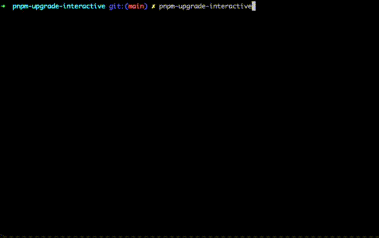

# pnpm-upgrade-interactive

A powerful interactive CLI tool for upgrading pnpm dependencies with ease. Inspired by `yarn upgrade-interactive`, this tool makes dependency management a breeze for pnpm projects. Perfect for monorepos, workspaces, and batch upgrades ❤️



## What it does

Ever found yourself staring at a wall of outdated packages, wondering which ones to upgrade? This tool helps you:

- **Scans your entire project** - finds all package.json files in your workspace
- **Checks for updates** - compares your current versions against the latest available
- **Lets you pick what to upgrade** - interactive interface to select exactly what you want
- **Does the heavy lifting** - updates your package.json files and runs pnpm install for you

## Why choose pnpm-upgrade-interactive?

If you're using pnpm and miss the convenience of `yarn upgrade-interactive`, this tool is perfect for you!

- **🚀 Fast & Efficient** - Batch upgrade multiple packages at once
- **🔒 Safe Updates** - Choose between minor updates or major version jumps
- **🏢 Monorepo Friendly** - Works seamlessly with workspaces
- **📦 Registry Aware** - Checks npm registry for latest versions
- **🎯 Selective Upgrades** - Pick exactly which packages to upgrade
- **⚡ Zero Config** - Works out of the box with sensible defaults

## Installation

### With npx (no installation needed)

```bash
npx pnpm-upgrade-interactive
```

### Install globally with pnpm

```bash
pnpm add -g pnpm-upgrade-interactive
```

### Alternative: npm

```bash
npm install -g pnpm-upgrade-interactive
```

## Usage

Just run it in your project directory:

```bash
pnpm-upgrade-interactive
```

The tool will scan your entire workspace (including monorepos), find outdated packages, and let you choose which ones to upgrade interactively.

### Command line options

- `-d, --dir <directory>`: Run in a specific directory (default: current directory)
- `-e, --exclude <patterns>`: Skip directories matching these regex patterns

Examples:

```bash
# Skip example and test directories
pnpm-upgrade-interactive --exclude "example,test"

# Skip specific paths with regex
pnpm-upgrade-interactive -e "example/.*,.*\.test\..*"

# Run in a different directory
pnpm-upgrade-interactive --dir ../my-other-project
```

### How it works

1. **Scans your project** - Finds all package.json files recursively
2. **Checks for updates** - Queries npm registry for latest versions
3. **Shows you options** - Interactive UI lets you pick what to upgrade
4. **Updates safely** - Modifies package.json

## License

MIT
